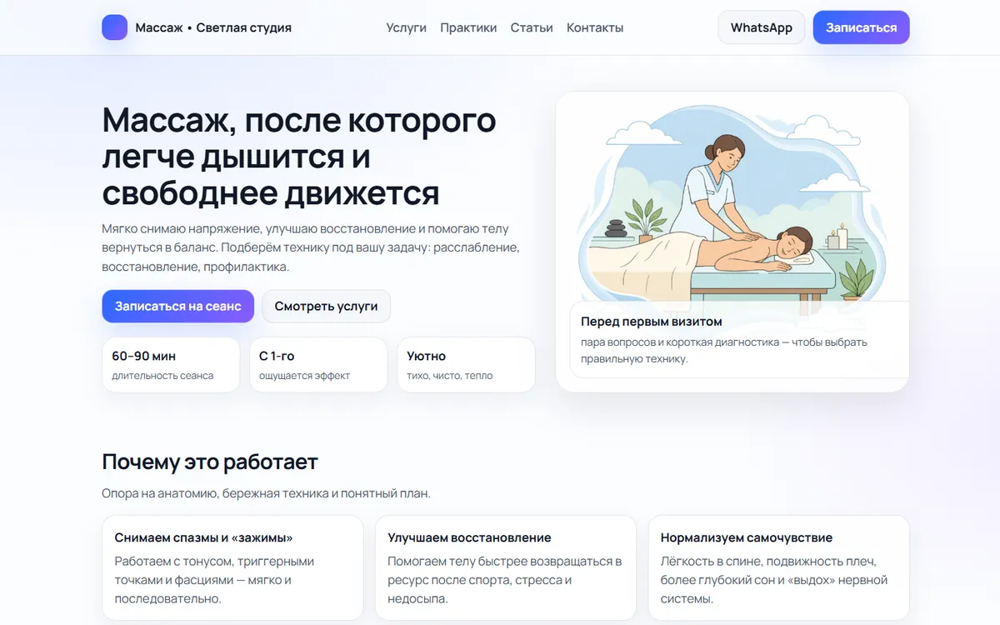
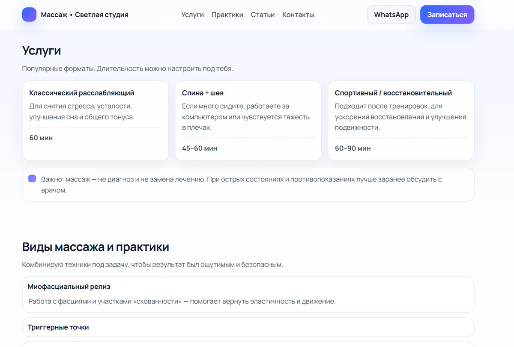

# Massage studio landing page

A light, responsive Russian-language landing page for a massage therapist, written in plain HTML, CSS and JavaScript with no framework and no build step. It covers services, massage types, short articles and contacts. Booking happens over WhatsApp: the buttons and the contact form open a chat with a pre-filled message. A "before your first visit" questionnaire opens in an accessible modal (focus moves into the dialog and returns afterwards) and saves the answers in the browser's `localStorage`. The mobile menu supports the Escape key and `aria-expanded`. The WhatsApp number is a placeholder constant at the top of `script.js`, waiting for the real one.

<p align="center">
  
</p>
<p align="center">
  
</p>

**Stack:** HTML5 · CSS3 · vanilla JavaScript.

## Run locally

Open `index.html` in a browser, or serve the folder:

```bash
python -m http.server 5173     # http://localhost:5173
```

## Author

Evgeny Nemchenko, full-stack developer: [bluecat.cc](https://bluecat.cc) · [LinkedIn](https://www.linkedin.com/in/evgeny-nemchenko) · [nevgeny90@gmail.com](mailto:nevgeny90@gmail.com) · [GitHub @Jony251](https://github.com/Jony251)
